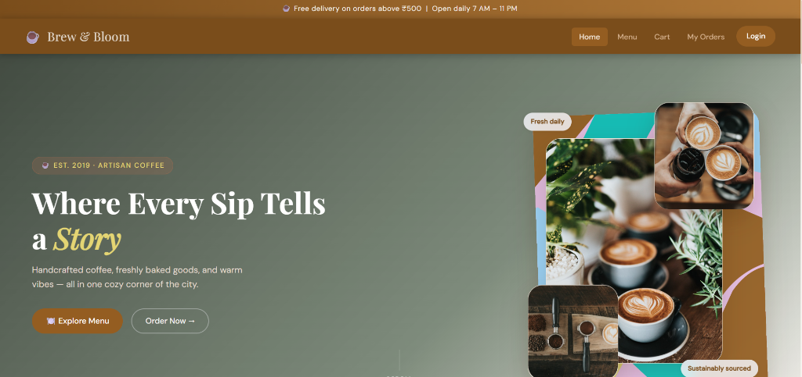
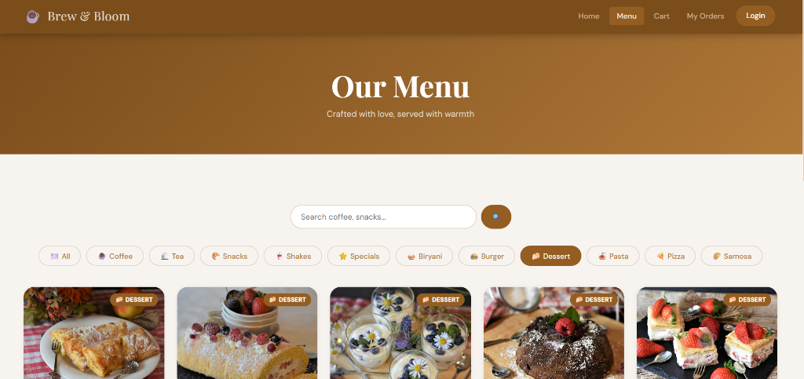
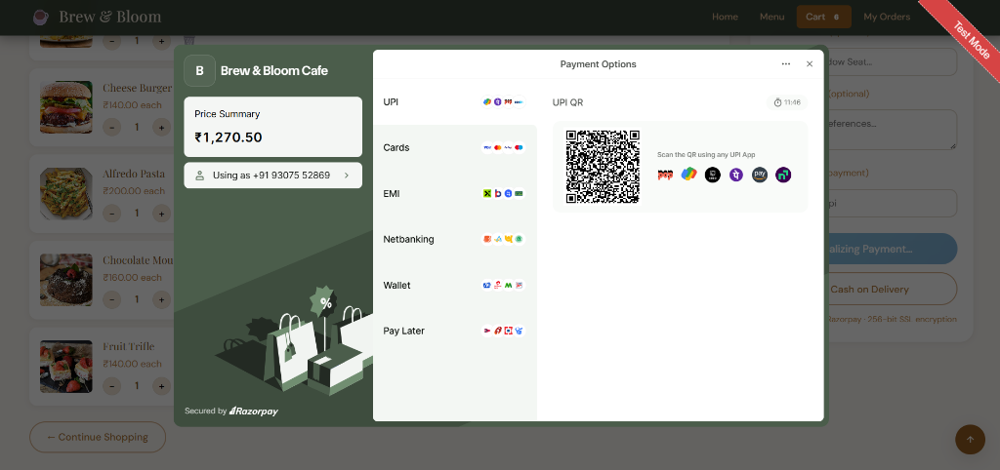
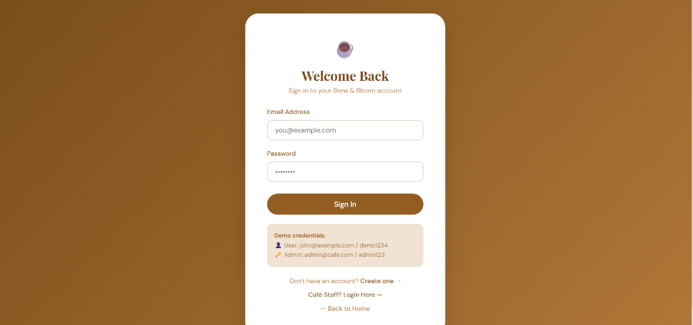
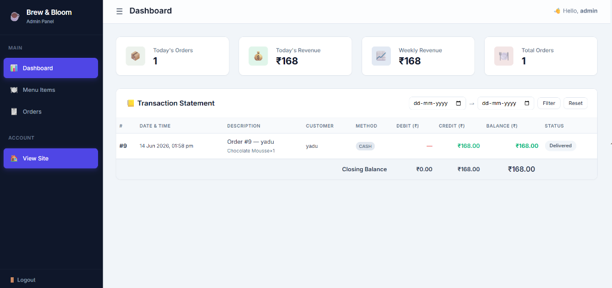

# ☕ Brew & Bloom Cafe — Full Stack Ordering Application

A production-grade cafe ordering web application with menu browsing, cart management, Razorpay payments, printable receipts, admin dashboard with bank-statement-style transaction ledger, and a review system.

## 📸 Application Preview

Below are the screenshots of **Brew & Bloom** showcasing the core screens of both the customer ordering flow and the administrative management backend:

### 1. Customer Experience & Ordering Flow

| **Home & Hero Section** | **Interactive Menu & Category Filters** |
| :---: | :---: |
|  |  |
| **Hero Landing Page:** A visually striking and modern landing page that welcomes customers, emphasizing the cafe's rich heritage with clear navigation links to menu browsing and checkout. | **Dynamic Menu & Filters:** Clean menu board with category tabs (Coffee, Tea, Snacks, Shakes, Desserts, etc.) powered by illustrative icons and a real-time instant search bar. |

| **Seamless Checkout & Razorpay Payments** | **User Sign-In & Authentication** |
| :---: | :---: |
|  |  |
| **Integrated Payment Gateway:** A sleek and modern checkout interface featuring pricing summaries and pre-integrated Razorpay options (UPI QR codes, cards, and wallets). | **Secure Authentication Hub:** A minimalist portal featuring session-based authentication, user registration, and a dedicated admin login portal, complete with easy-to-use demo credentials. |

---

### 2. Store Management & Analytics

| **Admin Dashboard & Transaction Ledger** |
| :---: |
|  |
| **Administrative Console:** Real-time business intelligence metrics showcasing today's orders, revenue, weekly stats, and a bank-statement-style searchable transaction statement. |


## Tech Stack

- **Frontend**: HTML5, CSS3, Vanilla JavaScript (ES6+)
- **Backend**: Node.js, Express 4.x
- **Database**: MySQL 8+ with Foreign Keys
- **Auth**: Session-based (express-session + MySQLStore), Passport (Google/Facebook OAuth)
- **Payments**: Razorpay integration
- **Media**: CoffeeAPI, Foodish API, Boonaki Tea API, Wikimedia Commons

## Project Structure

```
cafe-ordering/
├── server.js                 ← Entry point
├── package.json
├── .env                      ← DB credentials & API keys (not committed)
│
├── src/
│   ├── config/
│   │   ├── db.js             ← MySQL connection pool
│   │   └── constants.js      ← GST rate, order statuses, etc.
│   ├── middleware/
│   │   ├── isAdmin.js        ← Admin route guard
│   │   └── errorHandler.js   ← Global error handler
│   ├── routes/
│   │   ├── auth.js           ← Register / Login / Logout / OAuth
│   │   ├── menu.js           ← Menu & categories (public)
│   │   ├── orders.js         ← Place / track orders
│   │   ├── payment.js        ← Razorpay order & verification
│   │   ├── admin.js          ← Dashboard, orders, menu CRUD
│   │   └── reviews.js        ← Submit & fetch reviews
│   └── database/
│       ├── setup_db.js       ← Schema creation + seed data
│       └── seed_foodish.js   ← Foodish API seed script
│
├── public/
│   ├── index.html            ← Home page
│   ├── menu.html             ← Menu / ordering
│   ├── cart.html             ← Cart & checkout
│   ├── orders.html           ← Order history
│   ├── login.html            ← Login
│   ├── register.html         ← Registration
│   ├── dashboard.html        ← User dashboard
│   ├── payment-success.html  ← Printable receipt
│   ├── css/
│   │   ├── style.css         ← Main stylesheet
│   │   └── admin.css         ← Admin panel styles
│   ├── js/
│   │   ├── main.js           ← Shared utilities (API, Cart, Auth)
│   │   ├── menu.js           ← Menu page logic
│   │   ├── cart.js           ← Cart page logic
│   │   ├── orders.js         ← Orders page logic
│   │   ├── auth.js           ← Login/Register handlers
│   │   └── admin.js          ← Admin panel shared logic
│   └── admin/
│       ├── index.html        ← Admin dashboard + transaction statement
│       ├── menu.html         ← Menu CRUD
│       └── orders.html       ← Order management
└── ...
```

## Setup Instructions

### Prerequisites
- Node.js 16+
- MySQL 8+
- A Razorpay account (for payment integration)

### Step 1 — Clone & install
```bash
git clone <repo-url>
cd cafe-ordering
npm install
```

### Step 2 — Configure environment
Copy `.env.example` to `.env` and fill in your credentials:
```env
DB_HOST=localhost
DB_USER=root
DB_PASS=your_password
DB_NAME=cafe_db
SESSION_SECRET=your_random_secret
RAZORPAY_KEY_ID=your_key
RAZORPAY_KEY_SECRET=your_secret
```

### Step 3 — Create database
```bash
npm run setup
```

### Step 4 — Start the server
```bash
npm start
```

Visit **http://localhost:3000**

## Demo Credentials

| Role  | Email              | Password  |
|-------|--------------------|-----------|
| Admin | admin@cafe.com     | admin123  |
| User  | john@example.com   | demo1234  |

## Features

### Customer-Facing
- 🏠 **Home** — Hero banner, featured items, stats, live reviews with star ratings, review submission form
- 🍽️ **Menu** — Category filter tabs with icons, live search, image captions with dish name & tagline
- 🛒 **Cart** — Add/remove items, quantity controls, GST calculation, table number, UPI ID input
- 💳 **Checkout** — Razorpay payment with automatic UPI pre-selection
- 🧾 **Receipt** — Printable payment-success page with itemized bill
- 📋 **My Orders** — Order history with status tracking
- ⭐ **Reviews** — Submit reviews with star ratings, view approved reviews live

### Admin Panel (`/admin/`)
- 📊 **Dashboard** — Today's revenue, weekly stats, total orders, bank-statement-style transaction ledger with date filter
- 🍽️ **Menu Management** — Add/Edit/Delete items, image upload, category filter, bulk delete
- 📋 **Orders** — View all orders, update status inline

### Menus (100+ items)
| Category | Items | Image Source |
|---|---|---|
| ☕ Coffee | 10 | CoffeeAPI |
| 🍵 Tea | 10 | Boonaki Tea API / Wikimedia |
| 🍛 Biryani | 10 | Foodish API |
| 🍔 Burger | 10 | Foodish API |
| 🍰 Dessert | 10 | Foodish API |
| 🍝 Pasta | 10 | Foodish API |
| 🍕 Pizza | 10 | Foodish API |
| 🥟 Samosa | 10 | Foodish API |

## API Endpoints

| Endpoint | Methods | Description |
|---|---|---|
| `/api/register` | POST | Register new user |
| `/api/login` | POST | Login |
| `/api/logout` | POST | Logout |
| `/api/user` | GET | Get current session user |
| `/api/menu` | GET | List available menu items |
| `/api/menu/categories` | GET | List categories |
| `/api/orders/place` | POST | Place an order |
| `/api/orders/my-orders` | GET | Current user's orders |
| `/api/orders/:id` | GET | Single order with items |
| `/api/payment/create-order` | POST | Create Razorpay order |
| `/api/payment/verify` | POST | Verify Razorpay payment |
| `/api/reviews` | GET, POST | Submit & fetch reviews |
| `/api/admin/*` | Various | Admin-only routes |

## License

MIT
